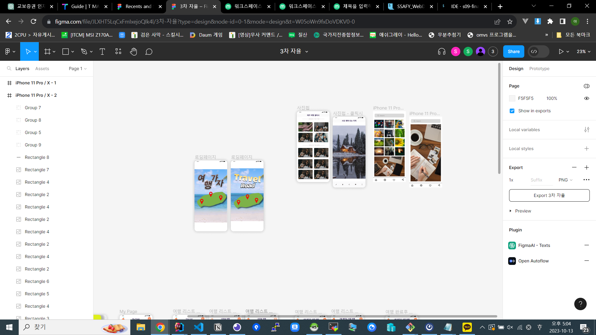
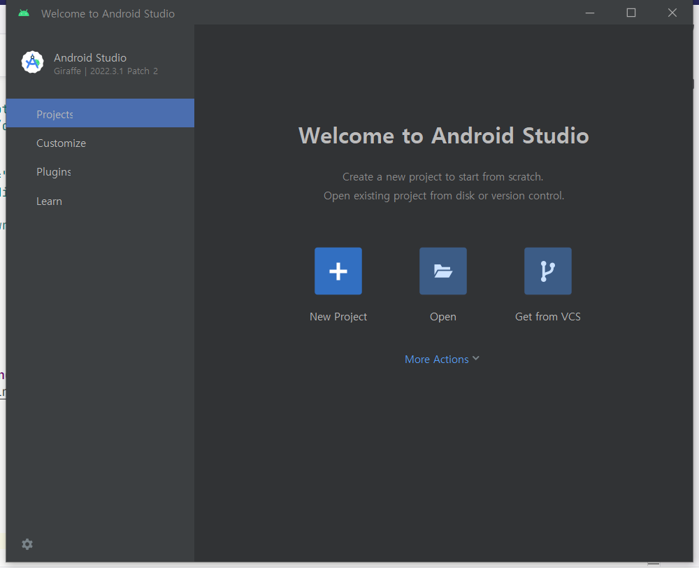
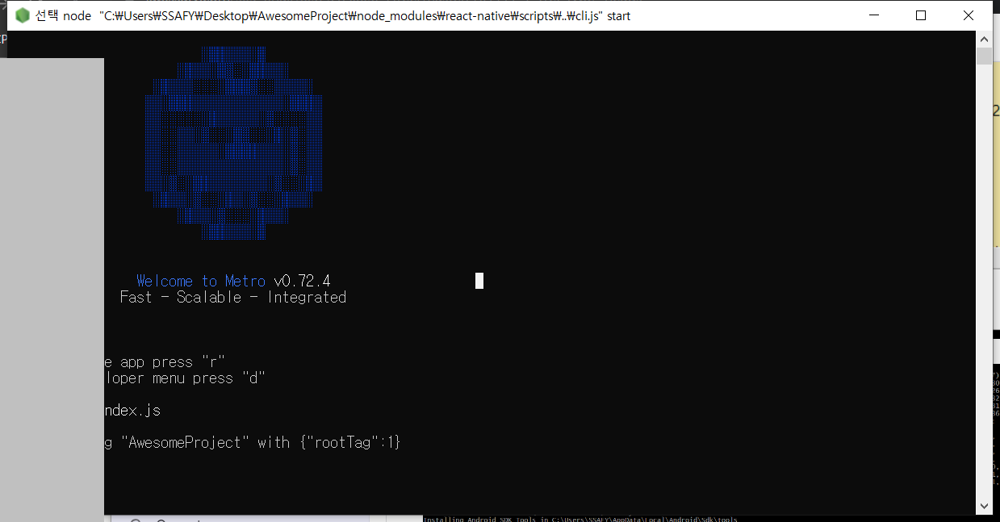
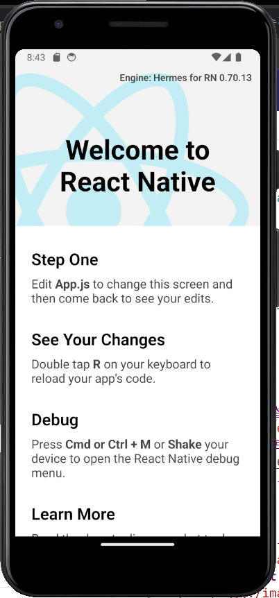
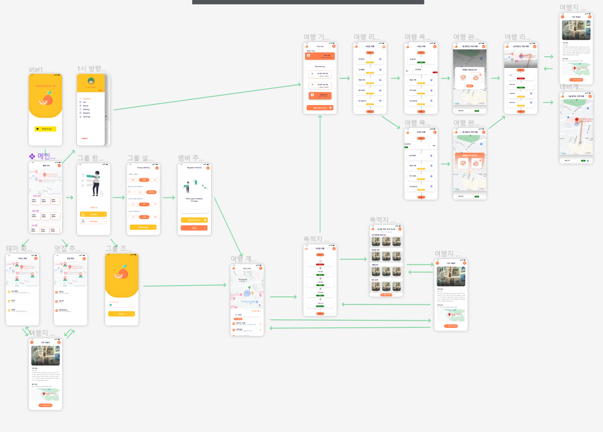

```
<!DOCTYPE html>
<html>
	<head>
		<meta http-equiv="Content-Type" content="text/html; charset=utf-8">
		<title>simpleMap</title>
		<script	src="https://code.jquery.com/jquery-3.2.1.min.js"></script>
		<script src="https://apis.openapi.sk.com/tmap/jsv2?version=1&appKey=발급받은 Appkey"></script>
		<script type="text/javascript">
			var map;
			var markerInfo;
			//출발지,도착지 마커
			var marker_s, marker_e, marker_p;
			//경로그림정보
			var drawInfoArr = [];
			var drawInfoArr2 = [];
		
			var chktraffic = [];
			var resultdrawArr = [];
			var resultMarkerArr = [];
		
			function initTmap() {
				// 1. 지도 띄우기
				map = new Tmapv2.Map("map_div", {
					center : new Tmapv2.LatLng(37.49241689559544, 127.03171389453507),
					width : "100%",
					height : "400px",
					zoom : 11,
					zoomControl : true,
					scrollwheel : true
				});
		
				// 2. 시작, 도착 심볼찍기
				// 시작
				marker_s = new Tmapv2.Marker(
						{
							position : new Tmapv2.LatLng(37.566567545861645,
									126.9850380932383),
							icon : "/upload/tmap/marker/pin_r_m_s.png",
							iconSize : new Tmapv2.Size(24, 38),
							map : map
						});
		
				//도착
				marker_e = new Tmapv2.Marker(
						{
							position : new Tmapv2.LatLng(37.403049076341794,
									127.10331814639885),
							icon : "/upload/tmap/marker/pin_r_m_e.png",
							iconSize : new Tmapv2.Size(24, 38),
							map : map
						});
		
				// 3. 경로탐색 API 사용요청
				$("#btn_select")
						.click(
								function() {
		
									//기존 맵에 있던 정보들 초기화
									resettingMap();
		
									var searchOption = $("#selectLevel").val();
		
									var trafficInfochk = $("#year").val();
									var headers = {}; 
										headers["appKey"]="발급AppKey";

									//JSON TYPE EDIT [S]
									$.ajax({
										type : "POST",
										headers : headers,
										url : "https://apis.openapi.sk.com/tmap/routes?version=1&format=json&callback=result&appKey=발급AppKey",
										async : false,
										data : {
											"startX" : "126.9850380932383",
											"startY" : "37.566567545861645",
											"endX" : "127.10331814639885",
											"endY" : "37.403049076341794",
											"reqCoordType" : "WGS84GEO",
											"resCoordType" : "EPSG3857",
											"searchOption" : searchOption,
											"trafficInfo" : trafficInfochk
										},
										success : function(response) {

											var resultData = response.features;

											var tDistance = "총 거리 : "
													+ (resultData[0].properties.totalDistance / 1000)
															.toFixed(1) + "km,";
											var tTime = " 총 시간 : "
													+ (resultData[0].properties.totalTime / 60)
															.toFixed(0) + "분,";
											var tFare = " 총 요금 : "
													+ resultData[0].properties.totalFare
													+ "원,";
											var taxiFare = " 예상 택시 요금 : "
													+ resultData[0].properties.taxiFare
													+ "원";

											$("#result").text(
													tDistance + tTime + tFare
															+ taxiFare);

											//교통정보 표출 옵션값을 체크
											if (trafficInfochk == "Y") {
												for ( var i in resultData) { //for문 [S]
													var geometry = resultData[i].geometry;
													var properties = resultData[i].properties;

													if (geometry.type == "LineString") {
														//교통 정보도 담음
														chktraffic
																.push(geometry.traffic);
														var sectionInfos = [];
														var trafficArr = geometry.traffic;

														for ( var j in geometry.coordinates) {
															// 경로들의 결과값들을 포인트 객체로 변환 
															var latlng = new Tmapv2.Point(
																	geometry.coordinates[j][0],
																	geometry.coordinates[j][1]);
															// 포인트 객체를 받아 좌표값으로 변환
															var convertPoint = new Tmapv2.Projection.convertEPSG3857ToWGS84GEO(
																	latlng);

															sectionInfos
																	.push(convertPoint);
														}

														drawLine(sectionInfos,
																trafficArr);
													} else {

														var markerImg = "";
														var pType = "";

														if (properties.pointType == "S") { //출발지 마커
															markerImg = "/upload/tmap/marker/pin_r_m_s.png";
															pType = "S";
														} else if (properties.pointType == "E") { //도착지 마커
															markerImg = "/upload/tmap/marker/pin_r_m_e.png";
															pType = "E";
														} else { //각 포인트 마커
															markerImg = "http://topopen.tmap.co.kr/imgs/point.png";
															pType = "P"
														}

														// 경로들의 결과값들을 포인트 객체로 변환 
														var latlon = new Tmapv2.Point(
																geometry.coordinates[0],
																geometry.coordinates[1]
                                                        );
														// 포인트 객체를 받아 좌표값으로 다시 변환
														var convertPoint = new Tmapv2.Projection.convertEPSG3857ToWGS84GEO(
																latlon);

														var routeInfoObj = {
															markerImage : markerImg,
															lng : convertPoint._lng,
															lat : convertPoint._lat,
															pointType : pType
														};
														// 마커 추가
														addMarkers(routeInfoObj);
													}
												}//for문 [E]

											} else {

												for ( var i in resultData) { //for문 [S]
													var geometry = resultData[i].geometry;
													var properties = resultData[i].properties;

													if (geometry.type == "LineString") {
														for ( var j in geometry.coordinates) {
															// 경로들의 결과값들을 포인트 객체로 변환 
															var latlng = new Tmapv2.Point(
																	geometry.coordinates[j][0],
																	geometry.coordinates[j][1]
                                                            );
															// 포인트 객체를 받아 좌표값으로 변환
															var convertPoint = new Tmapv2.Projection.convertEPSG3857ToWGS84GEO(
																	latlng);
                                                            console.log(convertPoint._lat);
															console.log(convertPoint._lng);
															// 포인트객체의 정보로 좌표값 변환 객체로 저장
															var convertChange = new Tmapv2.LatLng(
																	convertPoint._lat,
																	convertPoint._lng);
															// 배열에 담기
															drawInfoArr
																	.push(convertChange);
														}
														drawLine(drawInfoArr,
																"0");
													} else {

														var markerImg = "";
														var pType = "";

														if (properties.pointType == "S") { //출발지 마커
															markerImg = "/upload/tmap/marker/pin_r_m_s.png";
															pType = "S";
														} else if (properties.pointType == "E") { //도착지 마커
															markerImg = "/upload/tmap/marker/pin_r_m_e.png";
															pType = "E";
														} else { //각 포인트 마커
															markerImg = "http://topopen.tmap.co.kr/imgs/point.png";
															pType = "P"
														}

														// 경로들의 결과값들을 포인트 객체로 변환 
														var latlon = new Tmapv2.Point(
																geometry.coordinates[0],
																geometry.coordinates[1]);
														// 포인트 객체를 받아 좌표값으로 다시 변환
														var convertPoint = new Tmapv2.Projection.convertEPSG3857ToWGS84GEO(
																latlon);

														var routeInfoObj = {
															markerImage : markerImg,
															lng : convertPoint._lng,
															lat : convertPoint._lat,
															pointType : pType
														};

														// Marker 추가
														addMarkers(routeInfoObj);
													}
												}//for문 [E]
											}
										},
										error : function(request, status, error) {
											console.log("code:"
													+ request.status + "\n"
													+ "message:"
													+ request.responseText
													+ "\n" + "error:" + error);
										}
									});
							//JSON TYPE EDIT [E]
						});
			}
		
			function addComma(num) {
				var regexp = /\B(?=(\d{3})+(?!\d))/g;
				return num.toString().replace(regexp, ',');
			}
		
			//마커 생성하기
			function addMarkers(infoObj) {
				var size = new Tmapv2.Size(24, 38);//아이콘 크기 설정합니다.
		
				if (infoObj.pointType == "P") { //포인트점일때는 아이콘 크기를 줄입니다.
					size = new Tmapv2.Size(8, 8);
				}
		
				marker_p = new Tmapv2.Marker({
					position : new Tmapv2.LatLng(infoObj.lat, infoObj.lng),
					icon : infoObj.markerImage,
					iconSize : size,
					map : map
				});
		
				resultMarkerArr.push(marker_p);
			}
		
			//라인그리기
			function drawLine(arrPoint, traffic) {
				var polyline_;
		
				if (chktraffic.length != 0) {
		
					// 교통정보 혼잡도를 체크
					// strokeColor는 교통 정보상황에 다라서 변화
					// traffic :  0-정보없음, 1-원활, 2-서행, 3-지체, 4-정체  (black, green, yellow, orange, red)
		
					var lineColor = "";
		
					if (traffic != "0") {
						if (traffic.length == 0) { //length가 0인것은 교통정보가 없으므로 검은색으로 표시
		
							lineColor = "#06050D";
							//라인그리기[S]
							polyline_ = new Tmapv2.Polyline({
								path : arrPoint,
								strokeColor : lineColor,
								strokeWeight : 6,
								map : map
							});
							resultdrawArr.push(polyline_);
							//라인그리기[E]
						} else { //교통정보가 있음
		
							if (traffic[0][0] != 0) { //교통정보 시작인덱스가 0이 아닌경우
								var trafficObject = "";
								var tInfo = [];
		
								for (var z = 0; z < traffic.length; z++) {
									trafficObject = {
										"startIndex" : traffic[z][0],
										"endIndex" : traffic[z][1],
										"trafficIndex" : traffic[z][2],
									};
									tInfo.push(trafficObject)
								}
		
								var noInfomationPoint = [];
		
								for (var p = 0; p < tInfo[0].startIndex; p++) {
									noInfomationPoint.push(arrPoint[p]);
								}
		
								//라인그리기[S]
								polyline_ = new Tmapv2.Polyline({
									path : noInfomationPoint,
									strokeColor : "#06050D",
									strokeWeight : 6,
									map : map
								});
								//라인그리기[E]
								resultdrawArr.push(polyline_);
		
								for (var x = 0; x < tInfo.length; x++) {
									var sectionPoint = []; //구간선언
		
									for (var y = tInfo[x].startIndex; y <= tInfo[x].endIndex; y++) {
										sectionPoint.push(arrPoint[y]);
									}
		
									if (tInfo[x].trafficIndex == 0) {
										lineColor = "#06050D";
									} else if (tInfo[x].trafficIndex == 1) {
										lineColor = "#61AB25";
									} else if (tInfo[x].trafficIndex == 2) {
										lineColor = "#FFFF00";
									} else if (tInfo[x].trafficIndex == 3) {
										lineColor = "#E87506";
									} else if (tInfo[x].trafficIndex == 4) {
										lineColor = "#D61125";
									}
		
									//라인그리기[S]
									polyline_ = new Tmapv2.Polyline({
										path : sectionPoint,
										strokeColor : lineColor,
										strokeWeight : 6,
										map : map
									});
									//라인그리기[E]
									resultdrawArr.push(polyline_);
								}
							} else { //0부터 시작하는 경우
		
								var trafficObject = "";
								var tInfo = [];
		
								for (var z = 0; z < traffic.length; z++) {
									trafficObject = {
										"startIndex" : traffic[z][0],
										"endIndex" : traffic[z][1],
										"trafficIndex" : traffic[z][2],
									};
									tInfo.push(trafficObject)
								}
		
								for (var x = 0; x < tInfo.length; x++) {
									var sectionPoint = []; //구간선언
		
									for (var y = tInfo[x].startIndex; y <= tInfo[x].endIndex; y++) {
										sectionPoint.push(arrPoint[y]);
									}
		
									if (tInfo[x].trafficIndex == 0) {
										lineColor = "#06050D";
									} else if (tInfo[x].trafficIndex == 1) {
										lineColor = "#61AB25";
									} else if (tInfo[x].trafficIndex == 2) {
										lineColor = "#FFFF00";
									} else if (tInfo[x].trafficIndex == 3) {
										lineColor = "#E87506";
									} else if (tInfo[x].trafficIndex == 4) {
										lineColor = "#D61125";
									}
		
									//라인그리기[S]
									polyline_ = new Tmapv2.Polyline({
										path : sectionPoint,
										strokeColor : lineColor,
										strokeWeight : 6,
										map : map
									});
									//라인그리기[E]
									resultdrawArr.push(polyline_);
								}
							}
						}
					} else {
		
					}
				} else {
					polyline_ = new Tmapv2.Polyline({
						path : arrPoint,
						strokeColor : "#DD0000",
						strokeWeight : 6,
						map : map
					});
					resultdrawArr.push(polyline_);
				}
		
			}
		
			//초기화 기능
			function resettingMap() {
				//기존마커는 삭제
				marker_s.setMap(null);
				marker_e.setMap(null);
		
				if (resultMarkerArr.length > 0) {
					for (var i = 0; i < resultMarkerArr.length; i++) {
						resultMarkerArr[i].setMap(null);
					}
				}
		
				if (resultdrawArr.length > 0) {
					for (var i = 0; i < resultdrawArr.length; i++) {
						resultdrawArr[i].setMap(null);
					}
				}
		
				chktraffic = [];
				drawInfoArr = [];
				resultMarkerArr = [];
				resultdrawArr = [];
			}
		</script>
	</head>
	<body onload="initTmap();">
		<div class="ft_area">
			<div class="ft_select_wrap">
				<div class="ft_select">
					<select id="selectLevel">
						<option value="0" selected="selected">교통최적+추천</option>
						<option value="1">교통최적+무료우선</option>
						<option value="2">교통최적+최소시간</option>
						<option value="3">교통최적+초보</option>
						<option value="4">교통최적+고속도로우선</option>
						<option value="10">최단거리+유/무료</option>
						<option value="12">이륜차도로우선</option>
						<option value="19">교통최적+어린이보호구역 회피</option>
					</select> <select id="year">
						<option value="N" selected="selected">교통정보 표출 옵션</option>
						<option value="Y">Y</option>
						<option value="N">N</option>
					</select>
					<button id="btn_select">적용하기</button>
				</div>
			</div>
			<div class="map_act_btn_wrap clear_box"></div>
			<div class="clear"></div>
		</div>
	
		<div id="map_wrap" class="map_wrap">
			<div id="map_div"></div>
		</div>
		<div class="map_act_btn_wrap clear_box"></div>
		<p id="result"></p>
		

	</body>
</html>
```
### 피그마 - 페이지 설계.

### 서버측 Rest로 경로에 대한  StringPath데이터 검증.
https://tmapapi.sktelecom.com/main.html#webservice/docs/tmapRouteDoc
### Node.js 18.18.2으로 협의

### RN 0.70으로 협의
 -> 기본이 JS라서.
### Android Studio 설치

### Android Project Create




### 피그마 플로우차트 그리기

